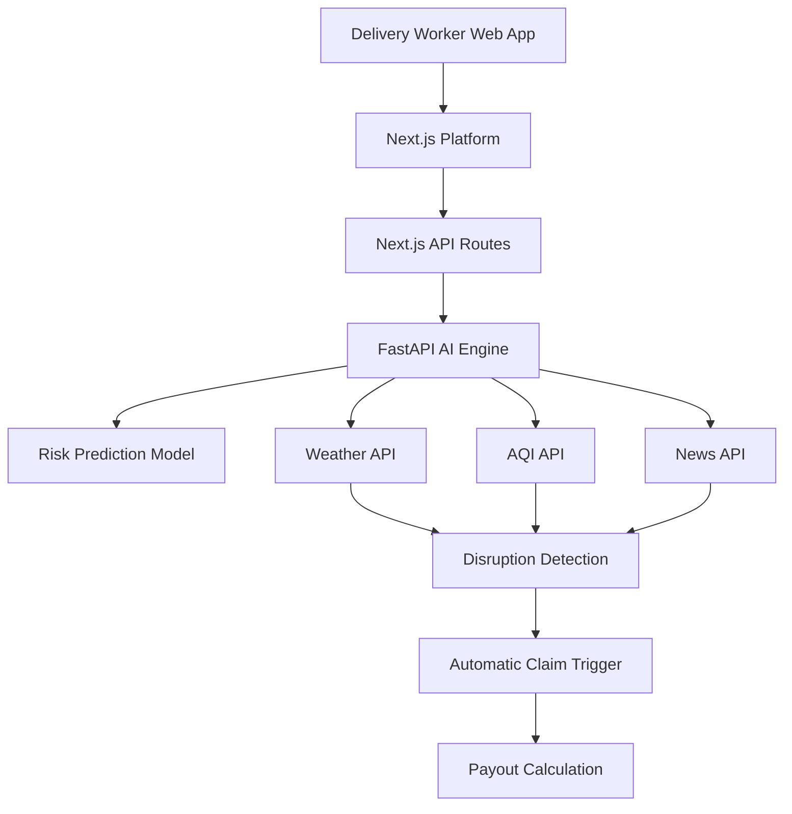
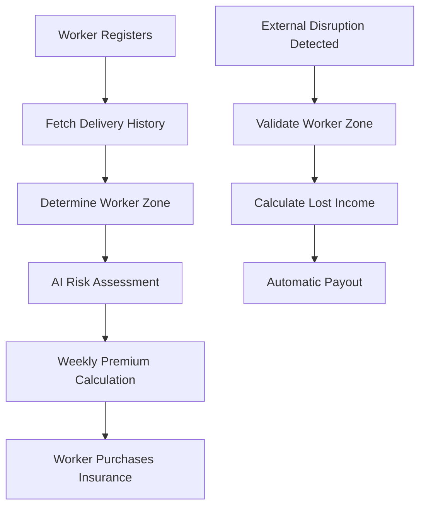

# Indic AI – Parametric Income Insurance for Food Delivery Workers

Guidewire DEVTrails 2026 Hackathon

---

# Problem

Food delivery workers rely on daily earnings.
External disruptions such as heavy rain, extreme heat, pollution, or strikes can stop deliveries and cause immediate income loss.

Gig workers currently have **no automated income protection**.

Our goal is to build an **AI-powered parametric insurance system** that automatically compensates workers when disruptions prevent them from working.

Key principle:

**We insure lost income, not accidents, vehicles, or health issues.**

---

# Solution Overview

Indic AI is an **automated parametric insurance platform** for food delivery workers.

Instead of manual claims:

1. External disruption detected
2. System validates affected workers
3. Lost income calculated
4. Instant payout triggered

This creates a **zero-touch insurance experience**.

---

# Key Features

### AI Risk Modeling

AI predicts disruption risk and worker income to dynamically price weekly insurance premiums.

### Dynamic Weekly Premium

Premiums are calculated using:

* predicted weekly earnings
* environmental risk
* zone disruption frequency

### Automated Parametric Claims

When disruption thresholds are met, the system automatically triggers payouts.

### Fraud Prevention

Multiple verification layers prevent fraudulent payouts.

### Hyperlocal Zone Risk

Different delivery zones have different risk levels.

The system calculates **zone-specific risk scores** using historical disruption data.

---

# Technology Stack

| Layer            | Technology                     | Reason                                  |
| ---------------- | ------------------------------ | --------------------------------------- |
| Frontend         | Next.js                        | Fast rendering, works on low-end phones |
| Backend APIs     | Next.js API Routes             | Lightweight backend                     |
| AI Engine        | FastAPI                        | Efficient AI service                    |
| Machine Learning | PyTorch                        | Supports GNN and transformers           |
| Data Sources     | Weather API, News API, AQI API | Real-time disruption signals            |

Why Next.js?

Delivery workers often use **budget Android phones**.
A lightweight web platform avoids installation and storage issues.

---

# System Architecture



---

# Workflow



---

# AI Risk Modeling

Our AI system combines **three risk signals**.

### Temporal Risk

Predicts future worker income using past earnings.

### Spatial Risk

Uses Graph Neural Networks to model risk across delivery zones.

### Environmental Risk

Analyzes:

* weather
* pollution
* disruption events

The model outputs a **risk index** used to price premiums.

Example formula:

```
premium = predicted_income × base_rate × (1 + risk_index)
```

Higher-risk zones pay slightly higher premiums.

---

# Disruption Detection

The platform continuously monitors external signals.

### Weather Monitoring

Heavy rain or extreme heat can halt deliveries.

Example trigger:

```
rainfall > threshold
temperature > 38°C
```

### Pollution Monitoring

```
AQI > 300
```

### Social Disruptions (Web Scraping)

Local strikes or protests are detected using news data.

The system fetches articles using a News API and scans for keywords such as:

* strike
* bandh
* protest
* curfew

Example workflow:

```
news articles
→ keyword detection
→ disruption event
```

If disruptions occur in a delivery zone, claims are triggered automatically.

---

# Location Verification

Workers do not manually enter their location.

Instead, we analyze **delivery history from the platform**.

Example:

```
last 20 deliveries
→ identify most frequent zone
→ assign worker zone
```

This prevents location spoofing.

---

# Fraud Prevention

The system includes multiple safeguards.

### Duplicate Claim Protection

Each disruption event has a unique ID.

```
disruption_id
```

Duplicate payouts are rejected.

---

### Worker Identity Validation

Workers are verified using:

* employee ID
* delivery platform data

---

### Activity Validation

Workers must be active before disruption.

Example rule:

```
deliveries_last_2_hours > 0
```

Inactive workers are excluded.

---

# Payout Calculation

When disruption occurs:

```
payout = hourly_income × disruption_duration
```

Example:

Hourly income = ₹120
Disruption duration = 3 hours

Payout = ₹360

This directly compensates **lost working hours**.

---

# Zone Risk Modeling

Instead of hardcoded values, the system calculates zone risk using historical disruption data.

Example inputs:

* rainfall frequency
* flood events
* traffic congestion
* strike occurrences

AI converts these signals into a **zone risk score** used for premium pricing.

---

# Automation Engine

The system monitors disruption signals periodically.

Example schedule:

```
every 30 minutes
```

Data sources checked:

* weather
* pollution
* news

If thresholds are exceeded, the payout process starts automatically.

---

# Impact

Indic AI provides **financial resilience for gig workers**.

The platform ensures workers receive compensation quickly when external disruptions prevent them from earning.

This creates a safety net for the growing gig economy.

---

# Demo Scenario

Heavy rain occurs in Bangalore.

1. Weather API detects rainfall threshold.
2. System identifies affected delivery zones.
3. Workers active in those zones are validated.
4. Lost income is calculated.
5. Automatic payouts are issued.

No manual claims required.

---

# Future Improvements

* AI risk heatmaps for delivery zones
* predictive disruption alerts
* deeper integration with delivery platforms
* advanced fraud detection models

---
