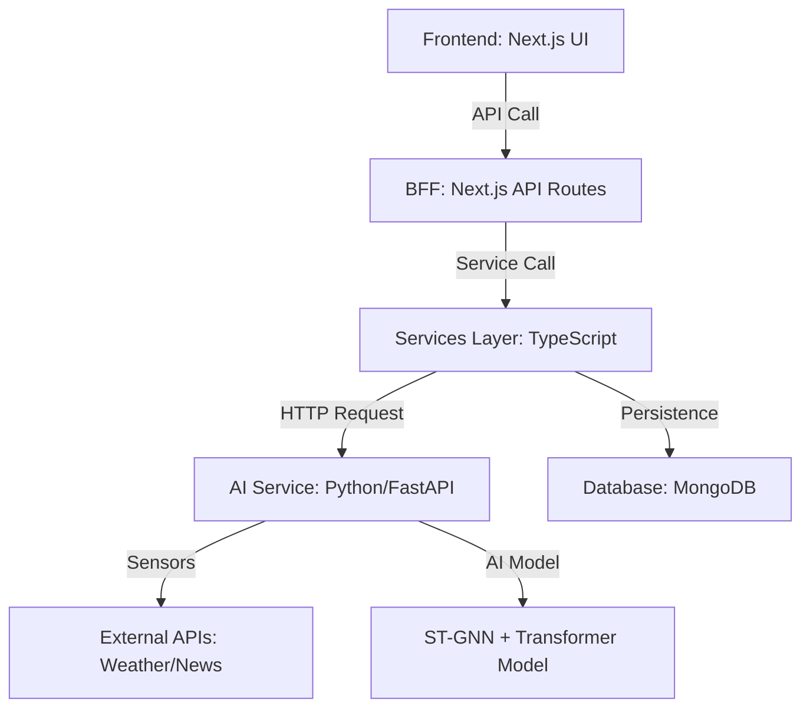

# Indic AI: Architectural Overview & Calculations

This document explains the flow of the **Indic AI** platform, from user interaction to the AI-driven calculations.

## 1. System Flow (Frontend to Backend)

Indic AI uses a layered architecture to separate the user interface, the business logic, and the AI engine.

1.  **User Interaction**: The worker interacts with the Next.js frontend (e.g., entering their city and platform).
2.  **API Proxy**: The frontend calls Next.js API routes (located in `src/app/api/`), which serve as a Backend-for-Frontend (BFF).
3.  **Service Layer**: These routes call specialized services ([premiumService.ts](file:///e:/guide_wire/frontend/src/services/premiumService.ts), [payoutService.ts](file:///e:/guide_wire/frontend/src/services/payoutService.ts)) that handle business logic and database persistence.
4.  **AI Service**: The services communicate with the Python-based AI service ([ai_service.py](file:///e:/guide_wire/ai_service.py)), which performs the heavy calculations.
5.  **Database**: Relevant data (Workers, Policies, Payouts) are stored in MongoDB via Mongoose models.

## 2. Backend Inputs

### Premium Request
When a worker asks for a premium quote, the system sends:
- `city`: To fetch local weather and news.
- `zone`: (Internal) To look up historical risk for that specific neighborhood.

### Payout Request (Simulation)
When a disruption occurs (or is simulated), the system sends:
- `disruption_id`: Unique identifier for the event.
- `duration_hrs`: How long the disruption lasted.
- `cargo_type`: e.g., "Standard_Meal" vs "Ultra_Perishable" (affects payout).
- `hourly_rate`: The worker's predicted hourly earning.
- `ambient_temp`: The temperature during the disruption (affects food spoilage).

## 3. Premium Calculation Logic

The premium is calculated dynamically using a multi-factor risk model.

**Formula:**
`Final Premium = (Predicted Income × 1%) × (1 + Env_Risk + Zonal_Historical_Risk)`

-   **Base Rate**: 1% of the predicted weekly income.
-   **Env_Risk (AI Index)**: Calculated by the ST-GNN model based on live weather (temp, rain) and temporal patterns.
-   **Zonal_Historical_Risk**: A "Turbulence Score" derived from historical data for that specific zone (simulated using a Beta distribution in the code).

## 4. Simulation: How it Works

The **Disruption Simulator** allows testing the system without waiting for real weather events.

-   **Scenarios**: The system has pre-defined scenarios (e.g., "Monsoon Downpour", "Extreme Heatwave").
-   **Sensor Mocking**: Each scenario specifies "fake" environmental data (e.g., 42°C temp, 5-hour duration).
-   **Payout Trigger**: Clicking "Simulate" sends this mock data to the `/get-payout` endpoint, as if a real sensor had triggered it.

## 5. Settlement & Payout Calculation

The payout compensates for lost time and potential loss of goods.

**Formula:**
`Payout = (Hourly Rate × Duration) × Spoilage_Multiplier`

-   **Hourly Rate**: Derived from the worker's predicted weekly income.
-   **Biological Decay (Spoilage)**: The system calculates a `decay_score` based on `Duration × Temp_Acceleration`.
-   **Multiplier**: If `decay_score > 2.0` (indicating high probability of spoiled food), the payout is multiplied by **1.5x**.

## 6. AI Model Details ([IndicNationalSTGNN](file:///e:/guide_wire/ai_service.py#21-36))

The "Brain" of the system uses three specialized neural networks:
1.  **Temporal Encoder (Transformer)**: Learns income patterns over time.
2.  **Spatial Encoder (GAT - Graph Attention Network)**: Learns how risk spreads between neighboring delivery zones.
3.  **Environmental Transformer**: Processes real-time sensor data (Weather, AQI) to detect anomalies.
